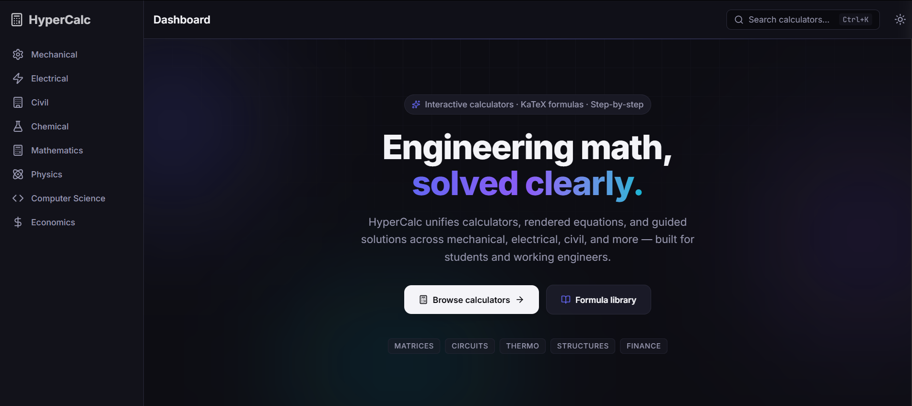

# HyperCalc

A comprehensive engineering calculator platform built with Next.js 14, TypeScript, and Tailwind CSS.

## Features

- **50+ Calculators** across 8 engineering domains:
  - Mechanical Engineering (8 calculators)
  - Electrical Engineering (10 calculators)
  - Civil Engineering (6 calculators)
  - Chemical Engineering (7 calculators)
  - Mathematics (8 calculators)
  - Physics (7 calculators)
  - Computer Science (7 calculators)
  - Engineering Economics (6 calculators)

- **Formula Reference Library** with searchable database
- **Global Search** (Ctrl+K) for calculators and formulas
- **Responsive Design** with mobile support
- **KaTeX Integration** for mathematical notation
- **Interactive Charts** with Recharts
- **Dark Mode Support**

### Screenshots

**Dashboard Overview**



## Tech Stack

### Frontend Core
- **Framework:** Next.js 14 (App Router)
- **Language:** TypeScript
- **Styling:** Tailwind CSS v4

### Engine & Features
- **Math Rendering:** KaTeX
- **Charts & Visualization:** Recharts
- **Fuzzy Search:** Fuse.js

### Backend & Deployment
- **Deployment:** Vercel
- **Data Architecture:** Embedded JSON/TS Configs

## Getting Started

### Prerequisites

- Node.js 18+
- npm or yarn

### Installation

1. Clone the repository:
```bash
git clone https://github.com/Darshanv2006/Hypercalc.git
cd Hypercalc
```

2. Install dependencies:
```bash
npm install
```

3. Run the development server:
```bash
npm run dev
```

4. Open [http://localhost:3000](http://localhost:3000) in your browser.

### Build for Production

```bash
npm run build
npm start
```

## Project Structure

```text
dv/
├── src/
│   ├── app/                 # Next.js app directory (Pages & Routing)
│   │   ├── [domain]/        # Domain-specific pages
│   │   ├── formulas/        # Formula reference library
│   │   ├── layout.tsx       # Root layout
│   │   └── page.tsx         # Home page
│   ├── components/          # Reusable UI components
│   │   ├── calculator/      # Calculator engine and visual components
│   │   └── layout/          # Layout components
│   ├── data/                # Formulas and domain data
│   └── lib/                 # Utility libraries and helpers
├── backend/                 # Data population and scripts
├── public/                  # Static assets
├── Screenshot/              # Project screenshots
├── package.json             # Core dependencies
└── tailwind.config.ts       # Styles configuration
```

## Available Scripts

- `npm run dev` - Start development server
- `npm run build` - Build for production
- `npm run start` - Start production server
- `npm run lint` - Run ESLint

## Deployment

This project is configured for deployment on Vercel:

1. Push to GitHub
2. Connect repository to Vercel
3. Deploy automatically on push

## SEO & Performance

- Lighthouse score ≥ 90 (target)
- Comprehensive sitemap and robots.txt
- Meta tags for all pages
- Optimized fonts and images

## Contributing

1. Fork the repository
2. Create a feature branch
3. Make your changes
4. Add tests if applicable
5. Submit a pull request

## 👨‍💻 Author

**Darshan V**
🚀 Full Stack Developer | Engineering Student

* 🔗 GitHub: https://github.com/Darshanv2006
* 💡 Project: HyperCalc
* ⚡ Tech: Next.js, TypeScript, Tailwind CSS


## License

MIT License - see LICENSE file for details.

## Acknowledgments

- Built with Next.js and Tailwind CSS
- Mathematical rendering powered by KaTeX
- Charts by Recharts
- Fuzzy search by Fuse.js
